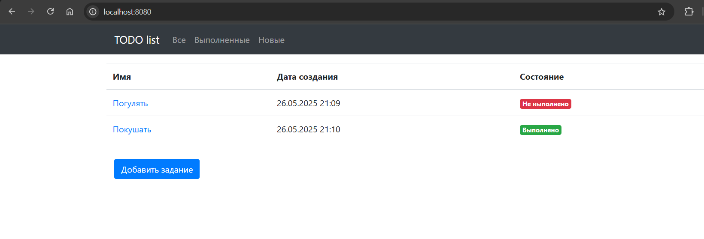
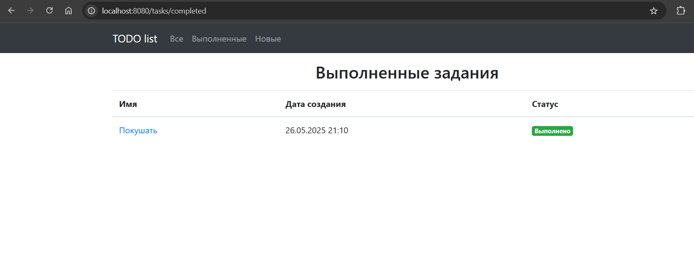
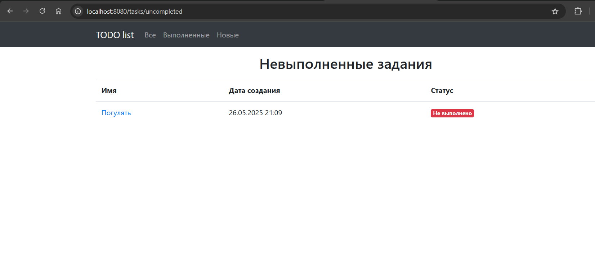
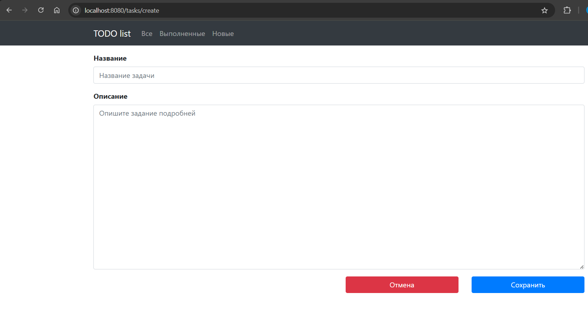
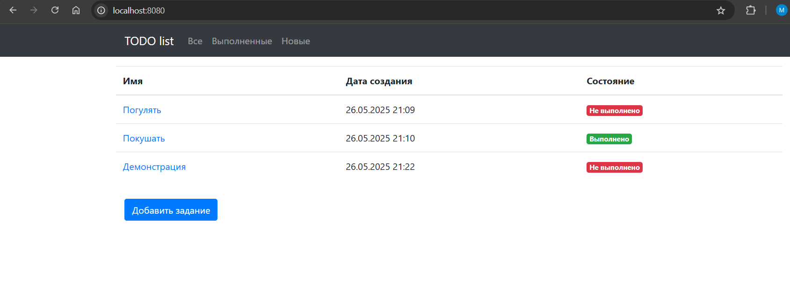
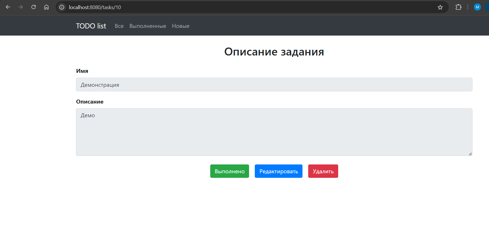
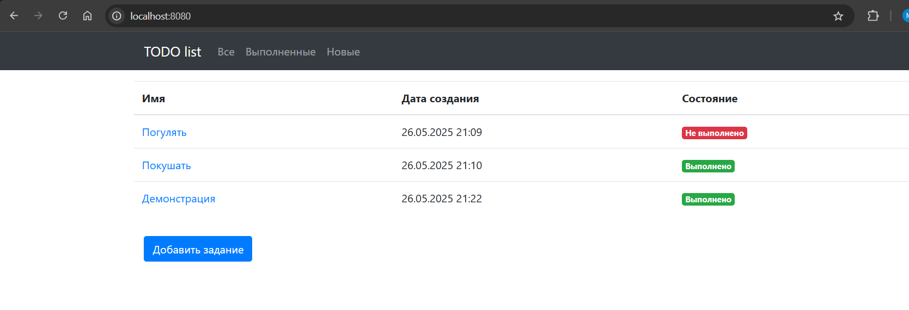
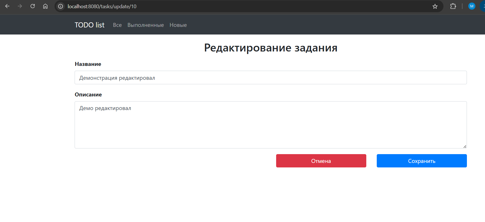
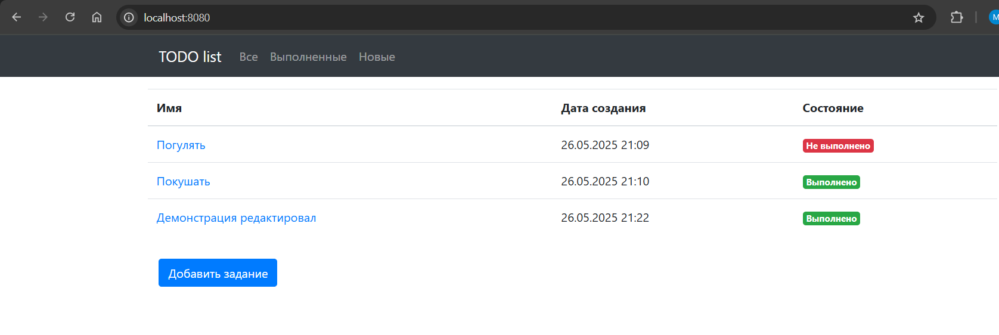
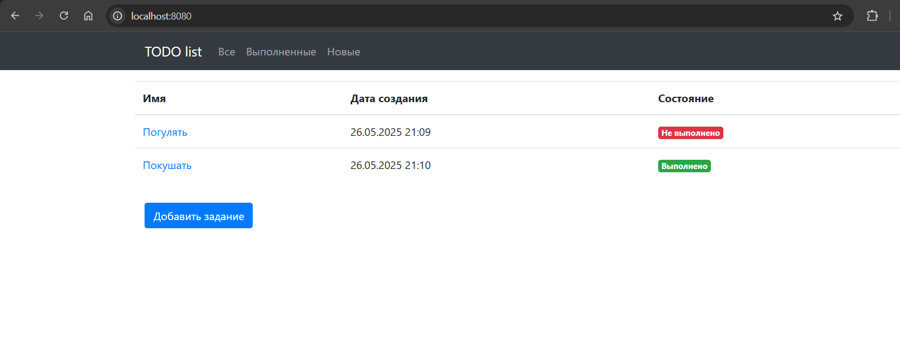

# Приложение "TODO список"

# Виды:
- Страница со списком всех заданий. В таблице отображаем имя, дату создания и состояние (выполнено или нет)
- На странице со списком кнопка "Добавить задание".
- На странице со списком три ссылки: "Все", "Выполненные", "Новые". 
- При переходе по ссылкам в таблице нужно отображаются: все задания, только выполненные или только новые.
- При клике на задание переходим на страницу с подробным описанием задания.
- На странице с подробным описанием кнопки: "Выполнено", "Редактировать", "Удалить".
- Если нажали на кнопку выполнить, то задание переводится в состояние выполнено.
- Кнопка "Редактировать" переводит пользователя на отдельную страницу для редактирования.
- Кнопка "Удалить" удаляет задание и переходит на список всех заданий.

# Стек технологий:
- Spring boot 
- Thymeleaf 
- Bootstrap 
- Hibernate 
- PostgreSql 

# Демонстрация работы приложения

- Для показа дальнейшего функционала добавил задание 'Демонстрация'

